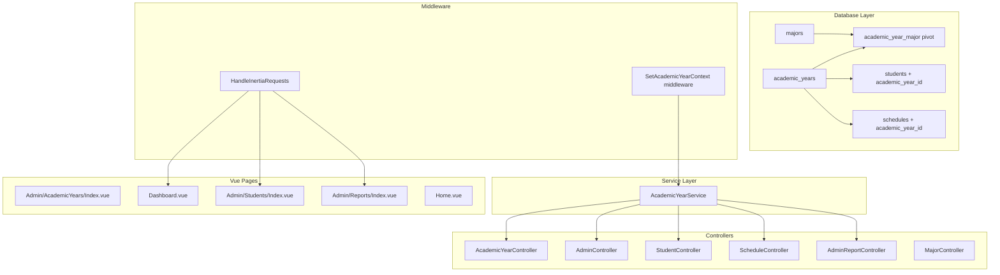
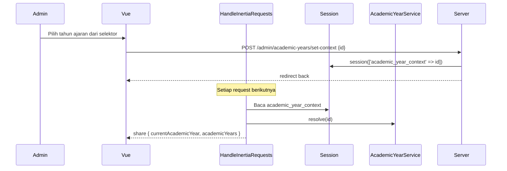

# Desain Teknis: Academic Year Management

## Ikhtisar

Fitur ini menambahkan dukungan multi-tahun ajaran pada aplikasi SPMB SMKN 8 TIK Jayapura. Saat ini seluruh data siswa, jadwal, dan kuota jurusan bercampur tanpa pemisahan periode. Desain ini memperkenalkan entitas `AcademicYear` sebagai konteks utama yang mengikat semua data operasional, sehingga setiap periode penerimaan berdiri sendiri dan data historis tetap terjaga.

Pendekatan yang dipilih adalah **context-scoped isolation**: setiap entitas operasional (Student, Schedule, kuota Major) diikat ke satu `AcademicYear` melalui foreign key atau tabel pivot. Admin memilih konteks tahun ajaran melalui selektor di UI, dan pilihan tersebut disimpan di session serta di-share ke semua halaman Vue melalui `HandleInertiaRequests`.

---

## Arsitektur



### Alur Konteks Tahun Ajaran (Admin)



---

## Komponen dan Antarmuka

### 1. AcademicYearService

Service utama yang merangkum semua logika bisnis terkait tahun ajaran. Semua controller menggunakan service ini, bukan mengakses model secara langsung.

```php
// app/Services/AcademicYearService.php
interface AcademicYearServiceInterface {
    public function getActive(): ?AcademicYear;
    public function getAll(): Collection;
    public function resolveContext(Request $request): ?AcademicYear;
    public function create(array $data): AcademicYear;
    public function activate(AcademicYear $year): void;
    public function close(AcademicYear $year): void;
    public function copyMajorConfig(AcademicYear $source, AcademicYear $target): void;
    public function getQuotaForMajor(AcademicYear $year, int $majorId): int;
    public function getAcceptedCountForMajor(AcademicYear $year, int $majorId): int;
}
```

### 2. AcademicYearController

Controller baru untuk CRUD tahun ajaran dan manajemen konteks sesi admin.

| Method | Route | Deskripsi |
|--------|-------|-----------|
| `index()` | GET `/admin/academic-years` | Halaman manajemen tahun ajaran |
| `store()` | POST `/admin/academic-years` | Buat tahun ajaran baru |
| `update()` | PUT `/admin/academic-years/{id}` | Perbarui data tahun ajaran |
| `activate()` | POST `/admin/academic-years/{id}/activate` | Aktifkan tahun ajaran |
| `close()` | POST `/admin/academic-years/{id}/close` | Tutup tahun ajaran |
| `destroy()` | DELETE `/admin/academic-years/{id}` | Hapus (jika tidak ada data) |
| `setContext()` | POST `/admin/academic-years/set-context` | Simpan konteks ke session |
| `majorConfig()` | GET `/admin/academic-years/{id}/majors` | Konfigurasi jurusan per tahun |
| `updateMajorConfig()` | PUT `/admin/academic-years/{id}/majors` | Perbarui kuota jurusan |

### 3. Perubahan Controller yang Ada

**AdminController**: Semua query student difilter berdasarkan `academic_year_id` dari konteks session.

**ScheduleController**: `index()` (halaman publik) mengambil jadwal dari tahun ajaran aktif. `adminIndex()` mengambil jadwal dari konteks session admin.

**StudentController**: `store()` mengambil `academic_year_id` dari tahun ajaran aktif dan menyertakannya saat membuat student. Validasi duplikat NIK dibatasi per tahun ajaran.

**AdminReportController**: Semua query difilter berdasarkan `academic_year_id` dari konteks session. Nama tahun ajaran disertakan di header ekspor.

**MajorController**: Kuota tidak lagi diambil dari `majors.quota` melainkan dari pivot `academic_year_major.quota`.

### 4. HandleInertiaRequests

Ditambahkan shared data berikut ke semua halaman Vue:

```php
'academicYear' => [
    'current' => $currentAcademicYear,   // objek tahun ajaran konteks admin
    'active'  => $activeAcademicYear,    // tahun ajaran berstatus active (untuk siswa)
    'all'     => $allAcademicYears,      // daftar semua tahun ajaran (untuk selektor)
],
```

---

## Model Data

### Tabel Baru: `academic_years`

```sql
CREATE TABLE academic_years (
    id            BIGINT UNSIGNED AUTO_INCREMENT PRIMARY KEY,
    name          VARCHAR(20) NOT NULL,          -- "2025/2026"
    start_year    SMALLINT UNSIGNED NOT NULL,    -- 2025
    end_year      SMALLINT UNSIGNED NOT NULL,    -- 2026
    status        ENUM('draft','active','closed') NOT NULL DEFAULT 'draft',
    description   TEXT NULL,
    created_at    TIMESTAMP NULL,
    updated_at    TIMESTAMP NULL,
    CONSTRAINT chk_year_range CHECK (end_year > start_year),
    INDEX idx_status (status)
);
```

### Tabel Baru: `academic_year_major` (pivot)

```sql
CREATE TABLE academic_year_major (
    id               BIGINT UNSIGNED AUTO_INCREMENT PRIMARY KEY,
    academic_year_id BIGINT UNSIGNED NOT NULL,
    major_id         BIGINT UNSIGNED NOT NULL,
    quota            SMALLINT UNSIGNED NOT NULL DEFAULT 30,
    is_active        BOOLEAN NOT NULL DEFAULT TRUE,
    created_at       TIMESTAMP NULL,
    updated_at       TIMESTAMP NULL,
    FOREIGN KEY (academic_year_id) REFERENCES academic_years(id) ON DELETE CASCADE,
    FOREIGN KEY (major_id) REFERENCES majors(id) ON DELETE CASCADE,
    UNIQUE KEY uq_ay_major (academic_year_id, major_id)
);
```

### Perubahan Tabel `students`

```sql
ALTER TABLE students
    ADD COLUMN academic_year_id BIGINT UNSIGNED NULL
        AFTER id,
    ADD CONSTRAINT fk_students_academic_year
        FOREIGN KEY (academic_year_id) REFERENCES academic_years(id)
        ON DELETE SET NULL,
    ADD INDEX idx_students_academic_year (academic_year_id);
```

Constraint unik NIK diubah dari global menjadi per tahun ajaran:

```sql
ALTER TABLE students DROP INDEX students_nik_unique;
ALTER TABLE students ADD UNIQUE KEY uq_nik_per_year (nik, academic_year_id);
```

### Perubahan Tabel `schedules`

```sql
ALTER TABLE schedules
    ADD COLUMN academic_year_id BIGINT UNSIGNED NULL
        AFTER id,
    ADD CONSTRAINT fk_schedules_academic_year
        FOREIGN KEY (academic_year_id) REFERENCES academic_years(id)
        ON DELETE CASCADE,
    ADD INDEX idx_schedules_academic_year (academic_year_id);
```

### Kolom `quota` di Tabel `majors`

Kolom `quota` di tabel `majors` dipertahankan sebagai nilai default global (fallback), namun kuota operasional per tahun ajaran diambil dari pivot `academic_year_major.quota`.

### Model Eloquent Baru: `AcademicYear`

```php
// app/Models/AcademicYear.php
class AcademicYear extends Model
{
    protected $fillable = ['name', 'start_year', 'end_year', 'status', 'description'];

    protected $casts = [
        'start_year' => 'integer',
        'end_year'   => 'integer',
    ];

    public function students(): HasMany
    {
        return $this->hasMany(Student::class);
    }

    public function schedules(): HasMany
    {
        return $this->hasMany(Schedule::class);
    }

    public function majors(): BelongsToMany
    {
        return $this->belongsToMany(Major::class, 'academic_year_major')
            ->withPivot(['quota', 'is_active'])
            ->withTimestamps();
    }

    public function isActive(): bool { return $this->status === 'active'; }
    public function isDraft(): bool  { return $this->status === 'draft'; }
    public function isClosed(): bool { return $this->status === 'closed'; }

    public static function getActive(): ?self
    {
        return static::where('status', 'active')->first();
    }
}
```

### Perubahan Model `Student`

```php
// Tambahkan ke $fillable
'academic_year_id',

// Tambahkan relasi
public function academicYear(): BelongsTo
{
    return $this->belongsTo(AcademicYear::class);
}
```

### Perubahan Model `Schedule`

```php
// Tambahkan ke $fillable
'academic_year_id',

// Tambahkan relasi
public function academicYear(): BelongsTo
{
    return $this->belongsTo(AcademicYear::class);
}
```

### Perubahan Model `Major`

```php
// Tambahkan relasi
public function academicYears(): BelongsToMany
{
    return $this->belongsToMany(AcademicYear::class, 'academic_year_major')
        ->withPivot(['quota', 'is_active'])
        ->withTimestamps();
}

// Helper: kuota untuk tahun ajaran tertentu
public function quotaForYear(int $academicYearId): int
{
    $pivot = $this->academicYears()->wherePivot('academic_year_id', $academicYearId)->first();
    return $pivot?->pivot->quota ?? $this->quota;
}
```

---

## Strategi Migrasi Data Historis

Migrasi dilakukan dalam dua langkah terpisah:

**Langkah 1 — Migrasi Skema** (file migrasi Laravel biasa):
- Buat tabel `academic_years`
- Buat tabel `academic_year_major`
- Tambah kolom `academic_year_id` ke `students` (nullable)
- Tambah kolom `academic_year_id` ke `schedules` (nullable)
- Ubah unique constraint NIK

**Langkah 2 — Seeder Migrasi Data** (`HistoricalDataMigrationSeeder`):

```php
// database/seeders/HistoricalDataMigrationSeeder.php
public function run(): void
{
    // Idempoten: skip jika sudah ada
    if (AcademicYear::exists()) {
        return;
    }

    // Tentukan tahun dari registration_number yang ada
    $firstStudent = Student::whereNotNull('registration_number')
        ->where('registration_number', 'LIKE', 'SPMB-%')
        ->orderBy('registration_number')
        ->first();

    $year = $firstStudent
        ? (int) explode('-', $firstStudent->registration_number)[1]
        : now()->year;

    $startYear = $year - 1;
    $endYear   = $year;

    // Buat tahun ajaran default dengan status closed
    $academicYear = AcademicYear::create([
        'name'       => "{$startYear}/{$endYear}",
        'start_year' => $startYear,
        'end_year'   => $endYear,
        'status'     => 'closed',
        'description' => 'Tahun ajaran historis (migrasi otomatis)',
    ]);

    // Salin kuota dari majors ke pivot
    foreach (Major::all() as $major) {
        $academicYear->majors()->attach($major->id, [
            'quota'     => $major->quota,
            'is_active' => true,
        ]);
    }

    // Kaitkan semua student yang ada
    Student::whereNull('academic_year_id')
        ->update(['academic_year_id' => $academicYear->id]);

    // Kaitkan semua schedule yang ada
    Schedule::whereNull('academic_year_id')
        ->update(['academic_year_id' => $academicYear->id]);
}
```

Seeder ini idempoten: jika `AcademicYear::exists()` sudah true, tidak ada yang dilakukan.

---

## Halaman Vue yang Perlu Dibuat/Dimodifikasi

### Halaman Baru

| File | Deskripsi |
|------|-----------|
| `resources/js/Pages/Admin/AcademicYears/Index.vue` | Manajemen tahun ajaran: daftar, buat, edit, aktifkan, tutup, hapus |
| `resources/js/Pages/Admin/AcademicYears/MajorConfig.vue` | Konfigurasi kuota jurusan per tahun ajaran |

### Komponen Baru

| File | Deskripsi |
|------|-----------|
| `resources/js/Components/AcademicYearSelector.vue` | Dropdown selektor tahun ajaran untuk navbar admin |

### Halaman yang Dimodifikasi

| File | Perubahan |
|------|-----------|
| `Layouts/AdminLayout.vue` (atau layout yang ada) | Tambahkan `AcademicYearSelector` di navbar |
| `Pages/Admin/Students/Index.vue` | Tampilkan badge tahun ajaran aktif; sembunyikan aksi edit jika konteks `closed` |
| `Pages/Admin/Schedules/Index.vue` | Filter jadwal berdasarkan tahun ajaran konteks |
| `Pages/Admin/Reports/Index.vue` | Tambahkan filter tahun ajaran; tampilkan nama tahun di header ekspor |
| `Pages/Home.vue` | Tampilkan info tahun ajaran aktif; sembunyikan form jika tidak ada yang aktif |
| `Pages/Dashboard.vue` | Statistik difilter berdasarkan konteks tahun ajaran |

### Pola Penggunaan Shared Data di Vue

```vue
<script setup>
import { usePage } from '@inertiajs/vue3'
const { props } = usePage()
const currentAcademicYear = computed(() => props.academicYear?.current)
const isReadOnly = computed(() => currentAcademicYear.value?.status === 'closed')
</script>
```

---

## Penanganan Error

| Skenario | Respons Sistem |
|----------|----------------|
| Tidak ada tahun ajaran aktif saat siswa mendaftar | HTTP 422 dengan pesan "Pendaftaran belum dibuka. Tidak ada tahun ajaran aktif saat ini." |
| Hapus tahun ajaran yang memiliki data siswa | HTTP 422 dengan pesan "Tahun ajaran tidak dapat dihapus karena memiliki {n} data pendaftaran." |
| Alokasi siswa melebihi kuota jurusan | HTTP 422 dengan pesan "Kuota jurusan {nama} sudah penuh ({quota} siswa)." |
| Tahun mulai >= tahun selesai saat buat/edit | Validasi Laravel: "Tahun selesai harus lebih besar dari tahun mulai." |
| Duplikat NIK dalam satu tahun ajaran | HTTP 422 dengan pesan "NIK {nik} sudah terdaftar pada tahun ajaran ini." |
| Aktivasi tahun ajaran yang sudah active | HTTP 422 dengan pesan "Tahun ajaran ini sudah berstatus aktif." |

---

## Correctness Properties

*A property is a characteristic or behavior that should hold true across all valid executions of a system — essentially, a formal statement about what the system should do. Properties serve as the bridge between human-readable specifications and machine-verifiable correctness guarantees.*

### Property 1: Status awal selalu draft

*For any* data input valid yang diberikan ke endpoint pembuatan tahun ajaran, tahun ajaran yang tersimpan harus selalu memiliki status `draft`, terlepas dari nilai input lainnya.

**Validates: Requirements 1.2**

---

### Property 2: Invariant satu tahun ajaran aktif

*For any* kumpulan tahun ajaran dalam sistem, setelah operasi aktivasi dijalankan pada salah satu tahun ajaran, jumlah tahun ajaran dengan status `active` harus tepat satu.

**Validates: Requirements 1.3, 1.4**

---

### Property 3: Penutupan tahun ajaran aktif

*For any* tahun ajaran dengan status `active`, setelah operasi penutupan dijalankan, statusnya harus berubah menjadi `closed` dan tidak ada tahun ajaran lain yang berubah status.

**Validates: Requirements 1.5**

---

### Property 4: Penolakan penghapusan tahun ajaran berdata

*For any* tahun ajaran yang memiliki setidaknya satu data pendaftaran siswa, operasi penghapusan harus ditolak dengan pesan error yang informatif, dan data tahun ajaran harus tetap ada di database.

**Validates: Requirements 1.6**

---

### Property 5: Validasi rentang tahun

*For any* pasangan nilai `start_year` dan `end_year`, operasi buat atau perbarui tahun ajaran harus berhasil jika dan hanya jika `end_year > start_year`.

**Validates: Requirements 1.7**

---

### Property 6: Isolasi data entitas ke tahun ajaran

*For any* student atau schedule yang dibuat melalui sistem, entitas tersebut harus memiliki `academic_year_id` yang tidak null dan merujuk ke tahun ajaran yang valid.

**Validates: Requirements 2.1, 2.2**

---

### Property 7: Pendaftaran otomatis terikat ke tahun ajaran aktif

*For any* proses pendaftaran siswa yang berhasil, `academic_year_id` pada record student yang tersimpan harus sama dengan `id` tahun ajaran yang berstatus `active` pada saat pendaftaran dilakukan.

**Validates: Requirements 2.4**

---

### Property 8: Penolakan pendaftaran tanpa tahun ajaran aktif

*For any* percobaan pendaftaran siswa ketika tidak ada tahun ajaran berstatus `active`, sistem harus mengembalikan error dan tidak membuat record student baru.

**Validates: Requirements 2.5**

---

### Property 9: Format dan keunikan nomor pendaftaran per tahun ajaran

*For any* kumpulan pendaftaran dalam satu tahun ajaran, setiap nomor pendaftaran harus unik, dan formatnya harus cocok dengan pola `SPMB-{tahun}-{4 digit urutan}`.

**Validates: Requirements 2.6**

---

### Property 10: Filter data siswa berdasarkan konteks tahun ajaran

*For any* query daftar siswa dengan konteks tahun ajaran tertentu, semua record yang dikembalikan harus memiliki `academic_year_id` yang sama dengan konteks yang dipilih, dan tidak ada record dari tahun ajaran lain yang muncul.

**Validates: Requirements 2.7, 4.2**

---

### Property 11: Penyalinan konfigurasi jurusan ke tahun ajaran baru

*For any* pembuatan tahun ajaran baru ketika sudah ada tahun ajaran sebelumnya, tabel pivot `academic_year_major` untuk tahun ajaran baru harus berisi semua jurusan aktif dari tahun ajaran terakhir dengan nilai kuota yang sama.

**Validates: Requirements 3.1**

---

### Property 12: Isolasi konfigurasi kuota antar tahun ajaran

*For any* perubahan kuota jurusan pada satu tahun ajaran, nilai kuota jurusan yang sama pada tahun ajaran lain harus tetap tidak berubah.

**Validates: Requirements 3.2**

---

### Property 13: Validasi kuota saat alokasi siswa

*For any* jurusan dengan kuota `q` pada tahun ajaran tertentu, jika sudah ada `q` siswa yang diterima pada jurusan tersebut di tahun ajaran yang sama, maka operasi alokasi siswa berikutnya ke jurusan tersebut harus ditolak.

**Validates: Requirements 3.3, 3.4**

---

### Property 14: Konteks tahun ajaran tersimpan di session

*For any* operasi pemilihan tahun ajaran oleh admin, nilai `academic_year_context` di session harus diperbarui dengan `id` tahun ajaran yang dipilih, dan nilai tersebut harus konsisten di seluruh request berikutnya dalam sesi yang sama.

**Validates: Requirements 4.5**

---

### Property 15: Statistik laporan konsisten dengan filter tahun ajaran

*For any* permintaan laporan dengan filter tahun ajaran tertentu, semua angka statistik yang dikembalikan (total pendaftar, diterima, per jurusan) harus hanya mencakup data dari tahun ajaran yang difilter, dan jumlah total harus sama dengan penjumlahan semua sub-kategori.

**Validates: Requirements 5.1, 5.5**

---

### Property 16: Nama tahun ajaran pada ekspor

*For any* ekspor laporan (PDF atau CSV) dengan konteks tahun ajaran tertentu, nama file dan header dokumen harus mengandung nama tahun ajaran yang bersangkutan.

**Validates: Requirements 5.3**

---

### Property 17: Isolasi data siswa (keamanan akses)

*For any* siswa yang terautentikasi, endpoint yang mengembalikan data pendaftaran harus hanya mengembalikan data milik siswa tersebut, dan tidak pernah mengembalikan data siswa lain meskipun `registration_number` atau `id` yang berbeda diberikan sebagai parameter.

**Validates: Requirements 6.4**

---

### Property 18: Penolakan pendaftaran duplikat NIK per tahun ajaran

*For any* NIK yang sudah terdaftar pada tahun ajaran aktif, percobaan pendaftaran kedua dengan NIK yang sama pada tahun ajaran aktif yang sama harus ditolak, dan jumlah record student tidak boleh bertambah.

**Validates: Requirements 6.5**

---

### Property 19: Idempoten migrasi data historis

*For any* kondisi database yang sudah menjalankan seeder migrasi historis, menjalankan seeder yang sama untuk kedua kalinya tidak boleh menghasilkan duplikasi data, perubahan status, atau error.

**Validates: Requirements 7.4**

---

### Property 20: Kelengkapan migrasi data historis

*For any* kondisi database setelah seeder migrasi historis dijalankan, tidak boleh ada record student atau schedule dengan `academic_year_id` bernilai null.

**Validates: Requirements 7.2, 7.3**

---

## Strategi Pengujian

### Pendekatan Dual Testing

Pengujian menggunakan dua pendekatan yang saling melengkapi:

- **Unit/Feature tests**: Memverifikasi contoh spesifik, edge case, dan kondisi error menggunakan PHPUnit (sudah tersedia di Laravel).
- **Property-based tests**: Memverifikasi properti universal di atas berbagai input yang di-generate secara acak menggunakan library **[Eris](https://github.com/giorgiosironi/eris)** (PHP property-based testing library).

### Konfigurasi Property-Based Testing

Library yang dipilih: **Eris** (`giorgiosironi/eris`)

```bash
composer require --dev giorgiosironi/eris
```

Setiap property test dikonfigurasi dengan minimum **100 iterasi**. Setiap test diberi tag komentar dengan format:

```
// Feature: academic-year-management, Property {N}: {deskripsi singkat}
```

### Unit/Feature Tests (PHPUnit)

Fokus pada:
- Contoh spesifik pembuatan dan aktivasi tahun ajaran (Requirements 1.1, 4.3)
- Tampilan halaman pendaftaran dengan/tanpa tahun ajaran aktif (Requirements 6.1, 6.2)
- Dashboard siswa menampilkan data yang benar (Requirements 6.3)
- Migrasi data historis dengan fixture data (Requirements 7.1)
- Integrasi `HandleInertiaRequests` share data `academicYear`

### Property-Based Tests (Eris)

Setiap correctness property di atas diimplementasikan sebagai **satu** property-based test. Contoh struktur:

```php
// Feature: academic-year-management, Property 2: Invariant satu tahun ajaran aktif
public function testSingleActiveAcademicYearInvariant(): void
{
    $this->forAll(
        Generator\choose(1, 10) // jumlah tahun ajaran random
    )->then(function (int $count) {
        // Buat $count tahun ajaran
        $years = AcademicYear::factory()->count($count)->create(['status' => 'draft']);
        // Aktifkan salah satu secara acak
        $toActivate = $years->random();
        $this->academicYearService->activate($toActivate);
        // Verifikasi hanya satu yang active
        $this->assertEquals(1, AcademicYear::where('status', 'active')->count());
    });
}
```

### Keseimbangan Unit vs Property Tests

- Unit tests menangkap bug konkret pada contoh spesifik dan edge case.
- Property tests memverifikasi kebenaran umum di seluruh ruang input.
- Hindari menulis terlalu banyak unit test untuk kasus yang sudah dicakup property test.
- Unit tests difokuskan pada: integrasi Inertia, tampilan UI, dan alur autentikasi.
