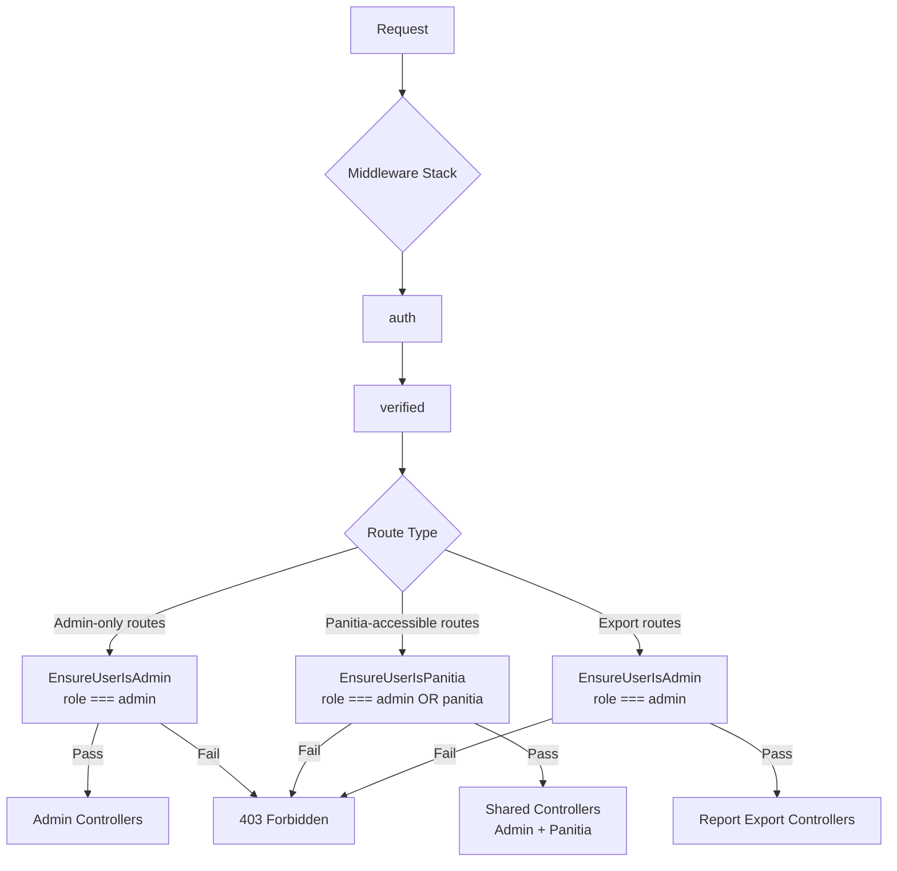

# Design Document: Panitia Role

## Overview

Fitur ini menambahkan role `panitia` ke sistem SPMB SMKN 8. Role ini memberikan akses operasional harian (verifikasi berkas, manajemen data siswa, inbox) tanpa akses ke fungsi konfigurasi sistem yang eksklusif untuk `admin`.

Pendekatan implementasi: **additive** — tidak mengubah logika yang sudah ada untuk `admin`, melainkan menambahkan middleware baru, memperluas enum role di database, menambahkan controller untuk manajemen akun panitia, dan menyesuaikan otorisasi di route yang relevan.

## Architecture



### Strategi Middleware

Sistem menggunakan dua middleware otorisasi:

| Middleware | Kondisi Lolos | Digunakan Pada |
|---|---|---|
| `EnsureUserIsAdmin` | `role === 'admin'` | Konfigurasi sistem, manajemen akun panitia, ekspor laporan, alokasi jurusan |
| `EnsureUserIsPanitia` | `role === 'admin' OR role === 'panitia'` | Dashboard, data siswa, verifikasi, inbox, laporan (view-only) |

## Components and Interfaces

### 1. Migration: Tambah `panitia` ke Enum Role

File baru: `database/migrations/YYYY_MM_DD_add_panitia_to_users_role_enum.php`

Mengubah kolom `role` dari `enum('admin','student')` menjadi `enum('admin','student','panitia')`.

### 2. Middleware: `EnsureUserIsPanitia`

File: `app/Http/Middleware/EnsureUserIsPanitia.php`

```php
public function handle(Request $request, Closure $next): Response
{
    if (!$request->user() || !in_array($request->user()->role, ['admin', 'panitia'])) {
        abort(403, 'Akses ditolak.');
    }
    return $next($request);
}
```

Didaftarkan di `bootstrap/app.php` dengan alias `panitia`.

### 3. Model: `User` — Tambah Helper Method

Tambahkan method `isPanitia()` ke model `User`:

```php
public function isPanitia(): bool
{
    return $this->role === 'panitia';
}

public function isAdminOrPanitia(): bool
{
    return in_array($this->role, ['admin', 'panitia']);
}
```

### 4. Controller: `PanitiaController`

File: `app/Http/Controllers/PanitiaController.php`

Menangani CRUD akun panitia, hanya dapat diakses oleh `admin`.

| Method | Route | Deskripsi |
|---|---|---|
| `index()` | GET `/admin/panitia` | Daftar semua akun panitia |
| `store(Request)` | POST `/admin/panitia` | Buat akun panitia baru |
| `update(Request, User)` | PUT `/admin/panitia/{user}` | Update nama/email panitia |
| `destroy(User)` | DELETE `/admin/panitia/{user}` | Hapus akun panitia |

### 5. Route Changes

**Route baru (admin-only):**
```php
Route::middleware(['auth', 'verified', 'admin'])->group(function () {
    Route::get('/admin/panitia', [PanitiaController::class, 'index'])->name('admin.panitia');
    Route::post('/admin/panitia', [PanitiaController::class, 'store'])->name('admin.panitia.store');
    Route::put('/admin/panitia/{user}', [PanitiaController::class, 'update'])->name('admin.panitia.update');
    Route::delete('/admin/panitia/{user}', [PanitiaController::class, 'destroy'])->name('admin.panitia.destroy');
});
```

**Route yang diubah dari `admin` ke `panitia` middleware:**
- `GET /dashboard`
- `GET /admin/students`, `GET /admin/students/{student}`
- `POST /admin/students/{student}/verify`
- `DELETE /admin/students/{student}`
- `GET /admin/inbox`, `GET /admin/inbox/compose`, `POST /admin/inbox/send`, `GET /admin/inbox/{message}`, `DELETE /admin/inbox/{message}`
- `GET /admin/reports` (view-only)

**Route yang tetap `admin`-only:**
- `POST /admin/students/{student}/allocate`
- `GET /admin/reports/pdf`, `GET /admin/reports/csv`
- Semua route `/admin/academic-years`, `/admin/majors`, `/admin/schedules`, `/admin/documents`, `/admin/registration-documents`

### 6. Frontend: Shared Props & Navigasi Kondisional

`HandleInertiaRequests` sudah meneruskan `auth.user` ke frontend. Karena `role` ada di model `User`, field ini otomatis tersedia di `auth.user.role` di Vue.

Komponen navigasi (sidebar/navbar) menggunakan `auth.user.role` untuk menyembunyikan menu eksklusif admin:

```vue
<template>
  <!-- Tampil untuk semua (admin & panitia) -->
  <NavItem :href="route('dashboard')" label="Dashboard" />
  <NavItem :href="route('admin.students')" label="Data Siswa" />
  <NavItem :href="route('admin.inbox')" label="Inbox" />
  <NavItem :href="route('admin.reports')" label="Laporan" />

  <!-- Hanya untuk admin -->
  <template v-if="$page.props.auth.user.role === 'admin'">
    <NavItem :href="route('admin.panitia')" label="Manajemen Panitia" />
    <NavItem :href="route('admin.academic-years')" label="Tahun Ajaran" />
    <NavItem :href="route('admin.majors')" label="Jurusan" />
    <NavItem :href="route('admin.schedules')" label="Jadwal" />
    <NavItem :href="route('admin.documents')" label="Template Dokumen" />
    <NavItem :href="route('admin.registration-documents')" label="Berkas Pendaftaran" />
  </template>
</template>
```

Tombol ekspor di halaman laporan juga dikondisikan:
```vue
<template v-if="$page.props.auth.user.role === 'admin'">
  <Button @click="exportPdf">Export PDF</Button>
  <Button @click="exportCsv">Export CSV</Button>
</template>
```

### 7. Halaman Vue Baru

`resources/js/Pages/Admin/Panitia/Index.vue` — halaman manajemen akun panitia dengan form create, tabel daftar, dan aksi edit/hapus.

## Data Models

### Perubahan pada Tabel `users`

```sql
-- Migration: ubah enum role
ALTER TABLE users MODIFY COLUMN role ENUM('admin', 'student', 'panitia') DEFAULT 'student';
```

Tidak ada tabel baru. Akun panitia disimpan di tabel `users` yang sudah ada dengan `role = 'panitia'`.

### User Model (setelah perubahan)

```
users
├── id
├── name
├── email
├── password
├── role: enum('admin', 'student', 'panitia')  ← ditambah 'panitia'
├── email_verified_at
└── ...
```

### Validasi Pembuatan Akun Panitia

```php
$request->validate([
    'name'     => 'required|string|max:255',
    'email'    => 'required|email|unique:users,email',
    'password' => 'required|string|min:8|confirmed',
]);
```

## Correctness Properties

*A property is a characteristic or behavior that should hold true across all valid executions of a system — essentially, a formal statement about what the system should do. Properties serve as the bridge between human-readable specifications and machine-verifiable correctness guarantees.*

### Property 1: Akun panitia selalu tersimpan dengan role yang benar

*For any* kombinasi nama, email, dan password yang valid yang dikirimkan admin untuk membuat akun panitia, akun yang tersimpan di database SHALL memiliki `role = 'panitia'`.

**Validates: Requirements 1.2**

---

### Property 2: Daftar akun panitia mencakup semua akun yang ada

*For any* kumpulan akun panitia yang tersimpan di database, endpoint daftar panitia SHALL mengembalikan semua akun tersebut tanpa ada yang terlewat.

**Validates: Requirements 1.7**

---

### Property 3: Middleware EnsureUserIsPanitia mengizinkan admin dan panitia, menolak yang lain

*For any* pengguna yang terautentikasi, middleware `EnsureUserIsPanitia` SHALL mengizinkan akses jika dan hanya jika `role` pengguna adalah `admin` atau `panitia`. Pengguna dengan role lain atau yang tidak terautentikasi SHALL ditolak.

**Validates: Requirements 2.3, 2.4, 2.5**

---

### Property 4: Perubahan status verifikasi siswa selalu tersimpan dengan benar

*For any* siswa dan *any* nilai status verifikasi yang valid (`verified` atau `rejected`), operasi verifikasi yang dilakukan panitia SHALL menghasilkan `verification_status` pada record siswa yang sama persis dengan nilai yang dikirimkan.

**Validates: Requirements 4.1**

---

### Property 5: Penghapusan siswa bersifat permanen

*For any* siswa yang ada di database, setelah operasi hapus berhasil dilakukan oleh panitia, siswa tersebut SHALL tidak dapat ditemukan lagi di database.

**Validates: Requirements 5.3**

---

### Property 6: Pesan inbox selalu menyimpan sender_id pengirim

*For any* pesan yang dikirim oleh panitia ke satu atau lebih siswa, setiap record `Inbox` yang tersimpan SHALL memiliki `sender_id` yang sama dengan `id` pengguna panitia yang mengirim pesan tersebut.

**Validates: Requirements 6.1, 6.4**

---

### Property 7: Panitia tidak dapat mengakses route eksklusif admin

*For any* pengguna dengan role `panitia` dan *any* route yang termasuk dalam daftar route eksklusif admin (academic-years, majors, schedules, documents, registration-documents, allocate, export), respons SHALL selalu berupa HTTP 403.

**Validates: Requirements 7.4, 8.1, 8.2, 8.3, 8.4, 8.5, 8.6**

---

### Property 8: Shared props selalu menyertakan role pengguna

*For any* pengguna yang terautentikasi (admin atau panitia), Inertia shared props SHALL selalu menyertakan field `auth.user.role` dengan nilai yang sesuai dengan role pengguna tersebut.

**Validates: Requirements 9.2**

## Error Handling

| Skenario | Respons |
|---|---|
| Panitia akses route admin-only | HTTP 403 |
| Unauthenticated akses route `panitia` middleware | Redirect ke `/login` |
| Email duplikat saat buat akun panitia | HTTP 422, error field `email` |
| Status verifikasi tidak valid | HTTP 422, error field `status` |
| Panitia akses endpoint ekspor | HTTP 403 |
| Hapus akun panitia yang tidak ada | HTTP 404 |

Semua error dikembalikan dalam format yang konsisten dengan respons Laravel validation yang sudah ada di sistem (Inertia error bag).

## Testing Strategy

### Unit Tests (PHPUnit)

Fokus pada logika spesifik yang tidak tercakup oleh property tests:

- `EnsureUserIsPanitia` middleware: admin lolos, panitia lolos, student 403, unauthenticated redirect
- `EnsureUserIsAdmin` tidak berubah: panitia tetap 403
- `PanitiaController@store`: email duplikat ditolak, redirect setelah sukses
- Login panitia: redirect ke `/dashboard`
- Logout panitia: sesi berakhir

### Property-Based Tests (PHPUnit + manual generators)

Menggunakan library **[eris/eris](https://github.com/giorgiosironi/eris)** (PHP property-based testing library).

Setiap property test dikonfigurasi minimum **100 iterasi**.

**Tag format:** `Feature: panitia-role, Property {N}: {property_text}`

| Property | Test | Generator |
|---|---|---|
| P1: Role panitia selalu benar | Generate random name/email/password, POST ke store, assert role='panitia' | `string()`, `email()` |
| P2: Daftar mencakup semua akun | Generate N akun panitia, GET index, assert semua ada di response | `choose(1..20)` akun |
| P3: Middleware role check | Generate user dengan random role, assert izin/tolak sesuai | `elements(['admin','panitia','student'])` |
| P4: Status verifikasi tersimpan | Generate random student + status valid, POST verify, assert status tersimpan | `elements(['verified','rejected'])` |
| P5: Hapus siswa permanen | Generate random student, DELETE, assert tidak ada di DB | random student factory |
| P6: sender_id selalu tersimpan | Generate random panitia + pesan, POST send, assert sender_id benar | `string()` subject/message |
| P7: Panitia 403 di admin routes | Generate panitia user, akses setiap admin-only route, assert 403 | `elements(adminOnlyRoutes)` |
| P8: Shared props menyertakan role | Generate admin/panitia user, GET any page, assert auth.user.role ada | `elements(['admin','panitia'])` |

### Integration Tests

- Login flow panitia end-to-end (credentials → session → dashboard)
- Navigasi kondisional: menu admin-only tidak muncul untuk panitia (Inertia response check)
- Tombol ekspor tidak muncul di halaman laporan untuk panitia

### Frontend Tests (Vitest + Vue Test Utils)

- Komponen navigasi: menu admin-only tersembunyi saat `auth.user.role === 'panitia'`
- Halaman laporan: tombol ekspor tersembunyi saat role panitia
- Halaman manajemen panitia: hanya render untuk admin
